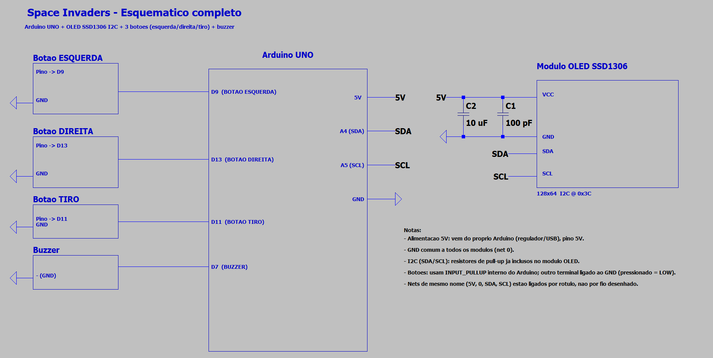
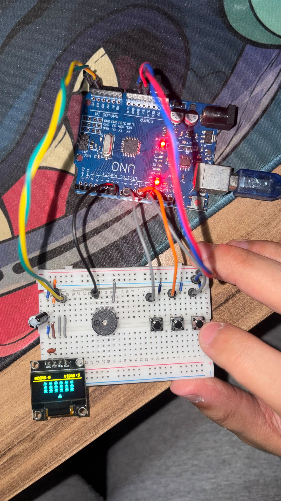

<div align="center">

# 👾 Space Invaders

**Clássico Space Invaders na tela OLED, com grade de inimigos, múltiplos tiros e IA simples — 100% em Arduino UNO**

[](https://www.arduino.cc/)
[](https://isocpp.org/)
[](https://choosealicense.com/licenses/mit/)

</div>

---

## 📋 Descrição

O **Space Invaders** é uma versão simplificada e fiel ao espírito do clássico de 1978, rodando inteiramente em um Arduino UNO com uma tela OLED SSD1306 128x64. Uma grade de 3 fileiras x 6 colunas de inimigos (cada fileira com um sprite diferente) se desloca lateralmente em bloco e desce um degrau sempre que toca a borda da tela — o padrão de movimento oscilante característico do jogo original. O jogador controla um canhão na base da tela com dois botões (esquerda/direita) e atira com um terceiro botão. Vários tiros do jogador e dos inimigos convivem na tela ao mesmo tempo, e de tempos em tempos um inimigo vivo atira de volta.

O maior desafio técnico do projeto foi de memória: o Arduino UNO tem apenas 2KB de SRAM, e o próprio buffer de vídeo da OLED já consome 1KB deles. Guardar 18 inimigos como um array de structs com posição individual seria caro demais — a solução foi representar a grade inteira com uma única posição-base (X/Y) mais um **bitmask de 32 bits** indicando quais inimigos ainda estão vivos, recalculando a posição de cada um a partir do seu índice de linha/coluna sempre que necessário. Os sprites dos inimigos e do jogador ficam em **PROGMEM** (memória Flash, que sobra bastante), sem gastar RAM.

---

## ⚙️ Componentes Utilizados

| Quantidade | Componente | Especificação |
|:---:|---|---|
| 1x | Arduino Uno (ou compatível) | Microcontrolador ATmega328P |
| 1x | Display OLED SSD1306 | I2C, 128x64 pixels, endereço 0x3C |
| 3x | Push buttons | Esquerda (D2), Direita (D3), Tiro (D4) — pull-up interno |
| 1x | Buzzer piezoelétrico passivo | Conectado ao pino D8 |
| — | Jumper wires | Macho-macho |
| 1x | Protoboard | — |

> **Buzzer passivo vs. ativo:** assim como no [[Jukebox]], este projeto usa um **buzzer passivo**, já que a frequência de cada efeito sonoro é gerada via `tone()`.

---

## 🔌 Pinagem

```
Arduino Uno
├── D2  → Botão ESQUERDA  [INPUT_PULLUP]
├── D3  → Botão DIREITA   [INPUT_PULLUP]
├── D4  → Botão TIRO      [INPUT_PULLUP]
├── D8  → Buzzer (passivo)
├── A4  → OLED SDA (I2C)
└── A5  → OLED SCL (I2C)
```

**Ligação dos botões:** cada botão conecta o pino ao GND. Com `INPUT_PULLUP`, o pino lê `HIGH` em repouso e `LOW` quando pressionado — sem necessidade de resistor externo.

---

## 🖼️ Esquemático




> Esquemático completo em `Esquemático/Draft1.asc`, pronto para abrir no LTspice.

---

## 🎮 Como Jogar

| Botão | Ação |
|:---:|---|
| ESQUERDA (D2) | Move o canhão para a esquerda |
| DIREITA (D3) | Move o canhão para a direita |
| TIRO (D4) | Dispara um projétil para cima |

- Qualquer botão inicia a partida na tela de título e reinicia após o game over
- Cada onda de inimigos derrotada aumenta a velocidade da grade na onda seguinte
- Perder as 3 vidas (atingido por um tiro inimigo) ou deixar a grade de inimigos avançar até a linha do jogador termina a partida
- Placar e recorde (salvo na EEPROM) aparecem na faixa amarela superior durante o jogo, na tela inicial e no game over

---

## 💻 Como Funciona

### Grade de inimigos como bitmask + posição-base

Em vez de um array de 18 structs com posição individual, a grade inteira é representada por três variáveis:

```cpp
uint32_t inimigosVivos;  // bit (linha*ENEMY_COLS+coluna) = 1 -> inimigo vivo
int16_t  inimigoBaseX;
int16_t  inimigoBaseY;
```

A posição de qualquer inimigo é sempre recalculada a partir do índice de linha/coluna e da posição-base:

```cpp
int16_t ex = inimigoBaseX + coluna * ENEMY_SPACING_X;
int16_t ey = inimigoBaseY + linha  * ENEMY_SPACING_Y;
```

Isso reduz o estado da grade inteira a 8 bytes (bitmask + duas coordenadas), contra os ~72 bytes que um array de 18 structs `{x, y}` de `int16_t` exigiria.

### Movimento oscilante

A cada tick de movimento, a borda esquerda/direita da grade é recalculada a partir da coluna viva mais externa (não da largura total original) — assim o comportamento continua correto conforme os inimigos das pontas vão morrendo. Ao encostar numa borda, a grade inverte a direção e desce um degrau (`ENEMY_STEP_Y`), reproduzindo o padrão de descida em zigue-zague do jogo original.

### Sprites em PROGMEM

Os 3 tipos de inimigo (um por fileira) e o sprite do jogador são bitmaps 8x8 armazenados na Flash:

```cpp
const uint8_t spriteInimigoTopo[SPRITE_H] PROGMEM = {
  0b00100100, 0b00100100, 0b01111110, 0b11011011,
  0b11111111, 0b10111101, 0b10100101, 0b00011000,
};
```

`display.drawBitmap()` lê diretamente da Flash, então os sprites não consomem SRAM.

### Tiros em arrays de structs pequenos

```cpp
struct Tiro { bool ativo; int16_t x, y; };
Tiro tirosJogador[MAX_TIROS_JOGADOR];   // até 2 tiros do jogador
Tiro tirosInimigos[MAX_TIROS_INIMIGOS]; // até 3 tiros dos inimigos
```

Cada tiro é atualizado e testado por colisão de forma independente a cada frame, sem realocar nada.

### IA de tiro dos inimigos

A cada intervalo aleatório, o jogo sorteia uma coluna que ainda tenha algum inimigo vivo e faz o inimigo **mais baixo** dessa coluna atirar — a mesma regra do jogo original, em que só o inimigo na linha de frente de cada coluna consegue disparar.

### Timing 100% não-bloqueante

Assim como o [[Snake]] e o [[Pong]], todo o jogo roda com `millis()` no lugar de `delay()`: movimento do jogador, tiros, movimento da grade e disparo dos inimigos têm seus próprios intervalos de tempo, todos verificados dentro do mesmo `loop()`.

---

## 🗂️ Estrutura dos Arquivos

```
SpaceInvaders/
├── README.md
├── post_linkedin.txt
├── sketch_space_invaders/
│   └── sketch_space_invaders.ino
├── Esquemático/
│   └── Draft1.asc
└── circuit_images/
    └── (fotos/simulação do circuito)
```

---

## 🚀 Como Usar

1. **Monte o circuito** conforme o esquemático acima.
2. **Instale o Arduino IDE** ([download](https://www.arduino.cc/en/software)).
3. **Instale as bibliotecas:** `Adafruit SSD1306` e `Adafruit GFX` (via Library Manager).
4. **Abra o sketch:** `sketch_space_invaders/sketch_space_invaders.ino`.
5. **Selecione a placa:** `Tools → Board → Arduino Uno`.
6. **Selecione a porta:** `Tools → Port → COMx` (Windows) ou `/dev/ttyUSBx` (Linux/Mac).
7. **Faça upload:** `Ctrl+U` ou botão Upload.
8. Aperte qualquer um dos 3 botões para começar a jogar.

---

## 🔧 Personalização

- **Tamanho da grade:** ajuste `ENEMY_COLS` e `ENEMY_ROWS` (o bitmask `inimigosVivos` suporta até 32 inimigos).
- **Dificuldade:** `INTERVALO_INIMIGOS_INICIAL_MS`, `INTERVALO_INIMIGOS_MINIMO_MS` e `ONDA_ACELERACAO_MS` controlam a velocidade da grade e sua progressão por onda.
- **Vidas iniciais:** `VIDAS_INICIAIS`.
- **Novos sprites de inimigo:** basta trocar os bytes dos arrays `spriteInimigoTopo`/`Meio`/`Base` (8 bytes = 8 linhas de 8 pixels cada, em binário).

> **Limite de memória:** com o buffer da OLED já ocupando metade da SRAM do Uno, evite trocar o bitmask da grade por um array de posições — é o que mantém o projeto rodando confortavelmente dentro dos 2KB disponíveis.

---

## 📄 Licença

Distribuído sob a licença MIT. Veja o arquivo [LICENSE](../LICENSE) para detalhes.

---

*Desenvolvido por Felipe Grolla*
